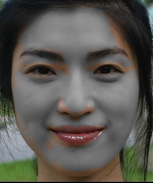
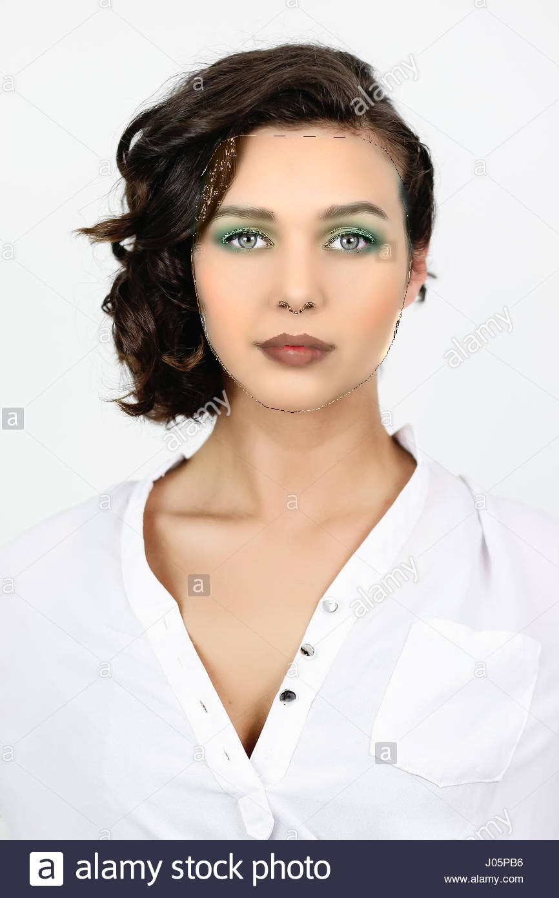

# Digital Makeup Transfer
Digital Makeup Transfer based on paper by Dong Guo and Terence Sim

### Procedure Followed:
- Landmark creation
  - Facial landmark detection
      - We used a python library function dlib to denote the pixel locations of 81 control points of the face which cover all the face control points. These include eyebrows, eyes, nose, lips and boundary of face. 
  - Landmark point division
      - Here we segmented the landmark points to assign them the region that they represent.
  - Create image masks using convex hull
      - We do this to display the different regions of the image.
  
    
  
- Triangulation / mesh creation
  - Compute triangles using cv2.Subdiv2D
  - Convert triangle points to landmark indices so that this mesh can be universally used in different images
  
    
  
- Assign every triangle the region it belongs to.
  - Each category is further divided into 3 regions on which different transfer method is to be used.
  - Apply affine transformation to resize and reorient corresponding triangles to get a warped image. 
  - Combining different triangles to get the transformed image.
      - created masks for combining different triangles. Here we faced a lot of issues because a lot of mesh lines were showing up. So we developed an innovative way to mask away the common boundary that was getting added multiple times when it is shared among different triangles.
        
  - Applying Transfers
      - We divided the image into 3 regions: 
          - C1 - Skin, eyebrows,nose [we call this "others" region]
          - C2 lips 
          - C3 eyes, mouth cavity 
      - We apply different transfers to different regions
      - Skin transfer
          - Here we divide the images into 3 layer components.
          - we first convert to LAB color space
          - Detail layer, structure layer, color layer
          - structure layer is obtained by applying Bilateral filtering
              - here we get try getting gradient with laplacian and sobel operators and we try to add it to smoothened structure layer. I.e we add edges to the image to add highlights to the resultant structure layer. 
          - Detail layer is got by subtracting structure layer from lightness component
              - Skin detail transfer - here we use a weighted sum of detailed layer from both example and the subject image
          - Color layer is the a,b component of LAB layer
              - Color transfer - where we apply alpha blending of color layers.
      - Lip tansfers
          - Here we convert the image into LAB color space.
          - we apply histogram equaliztion to both subject and example image.
          - Now for every point p in the subject image's lip region we find the closest lip point in the transfered image using the following similarity function
              {G(|q−p|)G(|E(q)− I(p)|)} where G is the gaussian function.
          - once we get the closest point we copy the color and lightness values to the result image.
      - in the eyes mouth cavity and background region no transfers are applied and we use these as it is.


        

 

 
      
- X-DOG 
    - In this part we apply xdog with different trhesholds to get multiple images. 
    - Once we get this stylized image, we input this into above pipeline to get makeup transfer on this image.  

              
      

# References
- Digital Makeup Transfer based on paper by Dong Guo and Terence Sim
- dlib predictor downloaded from https://github.com/codeniko/shape_predictor_81_face_landmarks


```python

```
